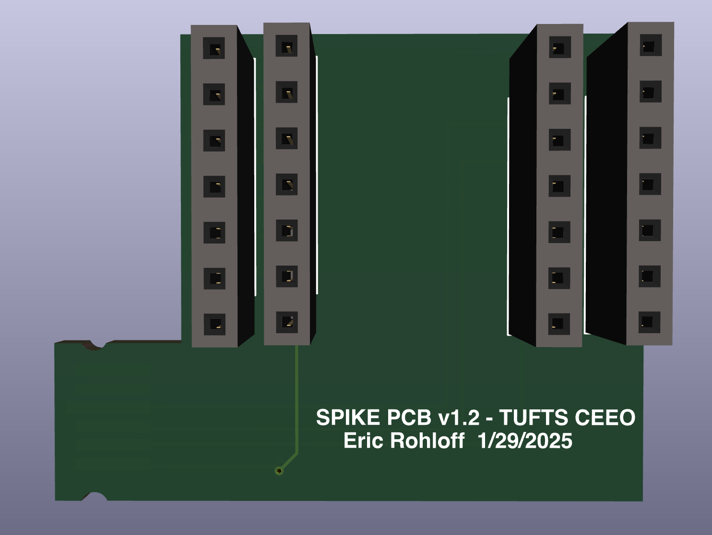

# LEGO SPIKE Prime PCB

A PCB for the LEGO SPIKE Prime that connects to one of the ports on the device.
This allows for UART communication between the SPIKE and a Seeed Studio Xiao
ESP32-C3. The repository contains instructions for how to set up the device and
and example using the SPIKE LED matrix.

## Hardware

-   LEGO SPIKE Prime
-   Seeed Studio Xiao ESP32-C3
-   4x 2.54mm 1x7 Female Pin Headers
-   Laser Cut or 3D Printed Acrylic Alignment Plate for the PCB to fit into the
    SPIKE

## Getting Started

### Hardware Setup

-   Download the zip file called 'spike-prime-pcb.zip' from the Github
    repository.
-   Aquire Hardware:
    -   LEGO SPIKE Prime
    -   Seeed Studio Xiao ESP32-C3
    -   4x 2.54mm Female Pin Headers
    -   Laser Cut or 3D Printed Acrylic Alignment Plate for the PCB to fit into
        the SPIKE
    -   PCB
-   Solder the 4x 2.54mm Femal Pin Headers to the PCB and attach arcrylic
    alignment plate to the PCB.
-   Connect the PCB to the SPIKE Prime in Port B or E and the Xiao ESP32-C3 to
    the PCB.

### Software Setup - SPIKE

-   Download mboot.dfu and firmware.dfu from the repository.
-   Put SPIKE into DFU mode by holding the bluetooth button and plugging in the
    USB cable. The LED will flash Rainbow colors.
-   Download the Python Files 'port.py' and'main.py' from the repository.
-   Navigate to the directory where the files are located and run the following
    command: `dfu-util --alt 0 -D firmware.dfu`
-   After the firmware is flashed, run the following command:
    `dfu-util --alt 1 -D mboot.dfu`
-   After the mboot is flashed, unplug the SPIKE and plug it back in while
    holding the left button. The SPIKE will flash letters on the LED matrix.
    Keep holding the left button until the letter 'F' appears
-   After the letter 'F' appears, connect the SPIKE to your computer and add the
    python files to the SPIKE using Thonny. The files should be in the root
    directory of the SPIKE.

### Software Setup - Xiao ESP32-C3

-   Flash micropython to the Xiao ESP32-C3 using your favorite version of
    micropython.
-   Download the 'main2.py' from the repository.
-   Connect the Xiao ESP32-C3 to your computer and add the 'main2.py' file to
    the root directory of the Xiao ESP32-C3 using Thonny and rename it to
    'main.py'.

### Using the SPIKE LED Matrix Demo

-   Download the 'light_example.py' and 'lights.py' files from the repository.
-   Connect the SPIKE to your computer and run the 'light_example.py' file using
    Thonny.
-   Connect the PCB to the SPIKE and the Xiao ESP32-C3 to the PCB.
-   Connect your favorite device to the wifi network 'SPIKE-UART' with the
    password shown in the 'main2.py' file.
-   Open a web browser and navigate to http://192.168.4.1
-   Send a message to the SPIKE using the text box and click send. The message
    will be displayed on the LED matrix.

## Files

-   'firmware.dfu' - The firmware file for the SPIKE
-   'light_example.py' - The light example file for the SPIKE
-   'lights.py' - The lights file for the SPIKE
-   'main.py' - The main file for the SPIKE
-   'main2.py' - The main file for the Xiao ESP32-C3 (rename to main.py)
-   'mboot.dfu' - The mboot file for the SPIKE
-   'pcb.png' - PCB Image
-   'port.py' - The port file for the SPIKE
-   'README.md' - This file
-   'spike-prime-pcb.svg' - The acrylic alignment plate files
-   'spike-prime-pcb.zip' - The PCB files
